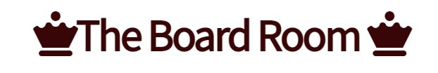
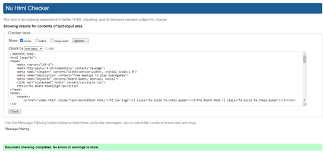

<h1 align="center">The Board Room Website</h1>

[Find The Board Room website here](https://fatimamahate.github.io/theboardroom/)

The Board Room is a website for board game lovers who would like to purchase board games as well as join monthly meetups to meet new people and play games. The website name is a play on the fact that we play games when we are bored and also the fact that this is exclusively a board game website. 

## Contents
* [User Experience (UX)](#user-experience-ux) 
* [Features](#features)
* [Design](#design)
* [Technologies Used](#technologies-used)
* [Testing](#testing)
* [Deployment](#deployment)
* [Credits](#credits)

## User Experience (UX)
Users of the website will
* find an overview of what The Board Room is all about.
* find out why The Board Room is worth visiting.
* find out what games are played in the meet up sessions.
* find out or be reminded of the meet up times and days.

## Features

### Features Across All Pages
* The logo is designed so that the user can click on it and be redirected to the home page (index.html). This is a standard in many websites and is therefore included. Furthermore, the logo is consistent on all pages.

* The footer includes logos of each of the respective social media. When the user clicks on the link, they are redirected into a new tab. The footer section has a brown border on the top to clearly distinguish itself from the section above. 

* The nav bar is also consistent on all pages. It changes to opposite colours when the user hovers over the text. The user will be sure they are selecting the correct page they require. 

### Home Page

* The home page greets the user with a hero image of a chess board. This was chosen due the popularity of the game and the fact that it is a game that is recognised around the world and in many cultures. There is also a block of text with concise description of the website.

* Beneath the hero image, we have the contrasting meet up section. This was to clearly split it up from the introduction as well as to make it eye catching to both new and frequent users. New users will be encouraged to sign up and frequent users will be able to easily find the meet up times in case they need to be reminded. 

* The meet up times are in white bordered boxes which can be clicked. It redirects the user to the sign-up page. When the user hovers over the boxes, colours are once again flipped like in the navigation bar. It is to fit in with the theme of the website.

* The last section (before the footer) involves the reasons to join. This is primarily for new users who have never been to a meet up before. The colours are again contrasted from the meet up to provide clear clarity between the two sections. 

### What's On

* The background image on the What's On page is of dice being thrown. This image was chosen due to its light colours and to remind the user that we have a wide variety of games. 

* The heading of the middle section makes use of the title of the page as well as telling the user what this page involves. 

* On a desktop, the user can hover over each game to find information regarding it. The box has a border in order to distinguish it from the background. A user using a touch-screen device may click on the game to find out the information. 

### Sign Up

* Similar to the home page, the background image is of a chess board. The user can find the form to the right of the page in a contrasting brown box. All sections of the form are required and this ensures the user does not accidentally forget to fill out a section.

* Since this page is linked to the meet up section of the homepage, the heading and icons above the form remains the same as the meet up section. This ensures continuity between the two pages. 

* The input fields for the name and email address both include a grey border. Whilst the color scheme for this website is only dark brown and white, the grey ensures the user can see that they are clicking on the correct box. If the borders remained either dark brown or white, the user would not have been able to clearly see which box they hovering over and there would be no contrast involved. 

* To choose which game the user prefers, there is a drop down menu with 4 options. The first one is the default and encourages user to select a game.

* The user has choice between thursday and friday as the meet up days. Since there is no limit on how many a customer can attend, the user may select both using checkboxes. 

* The user can choose to donate a board game but this is entirely optional. Since the user can either donate or not donate, the radio button is used. This ensures only one answer is selected. 

## Design

## Current

* Throughout the website, two primay colours are used. These are white and dark brown. This was inspired by the colours on a chess board. Furthermore, the brown was chosen since it is an earthy colour and so the user can feel comfortable. 

* There are 3 different images in the background. All images purposely have a light and dark element. For example, the hero image in the homepage is primarily light but with a single brown chess piece. This is eyecatching but also fits in with the more general light and dark theme of the website.

* All clickable links (except the logo and in the footer) changes so that when the user hovers over the text, the colour inverts. Furthermore, the boxes in the What's On page also invert when the user hovers, but they are not clickable (i.e will not link you to another page).

* A single font has been used throughout the website. The font used is Source Sans Pro and is imported from Google Fonts. This was used since it has a clean look and will appeal to modern audiences who may not play games as often.Another font called Permanent Marker was imported and trialled however is not used in the deployed website. 

### Future 
* It would be ideal to include a video on the homepage. This can entice the user and a new user can understand what The Board Room is about. 

* CSS grid would be useful to show images of the games in the What's On page. Futhermore, expanding The Board Room would mean more games to be included. An overlay such as the one in [this](https://www.w3schools.com/howto/howto_css_image_overlay.asp) website would be useful.

## Technologies

* [Google Fonts](https://fonts.google.com/) - Imported the Source Sans Pro font
* [Pexels](https://www.pexels.com/) - Used free to use images for background
* [Unsplash](https://unsplash.com/) - Used free to use images for background
* [Font Awesome](https://fontawesome.com/) - Used free to use icons for logo
* [Git](https://git-scm.com/) - Used for version control
* [Github](https://github.com/) - Used to contain the repository and to deploy
* HTML5
* CSS3

## Testing

### Functionality
* The image below shows the test for functionality of each interactive element.

#### Browsers
* This website was tested on both Google Chrome and Internet Edge. 

#### Responsive Media
* This website was tested on a laptop of 1024px, a tablet of 768px and mobiles of width 425px, 375px and 320px. The screens sizes above 1024px maintain the ratio with max width set as 1800px. 

* The media queries are split into three with the first having a max-width of 1024px, the second having a max-width of 540px and the third having a max-width of 320px. 

#### Laptop (1024px)

### Tablet (768px)

### Mobile (320px)

## Validation
### HTML
* HTML Validator can be found [here](https://validator.w3.org/)

### CSS

* CSS Validator can be found [here](https://jigsaw.w3.org/css-validator/)

## Deployment
### Deploy
* To deploy the site, first go to the GitHub repository.
* Click on Settings in the repository's nav bar. 
* On the left hand side, click on Pages
* Where is says branch, there is a dropdown menu. Select Main and then save.
* A live link should appear (this can take a while)

### Clone
* To clone a repository, go to the GitHub repository.
* Click on Code
* Copy the link
* Open GitBash
* Type in git clone, copy your URL and press enter.

### Push and Commit
* First in GitBash type in git add . 
* To commit any changes, type in git commit -m "Add your description of change here"
* Finally type in git push. This will push code to GitHub.

## Credits
### Content
* The idea to have text description of each game was through the idea of [overlays over images](https://www.w3schools.com/howto/howto_css_image_overlay.asp). 

* The footer was inspired by the Code Institute [Love Running](https://codeinstitute.net/) Project as part of PP1.

### Icons
* All icons that are used are from the [Font Awesome](https://fontawesome.com/) Website after searching chess. 

### Images
* Images are downloaded from [Pexels](https://www.pexels.com/) or [Unsplash](https://unsplash.com/)

    * The Home Page Chess image is from Unsplash and is by [Randy Faith](https://unsplash.com/photos/G1yhU1Ej-9A)

    * The What's On Page Dice image is from Unsplash and is by [Riho Kroll](https://unsplash.com/photos/m4sGYaHYN5o)

    * The Sign Up Page Chess image is from Pexels and is by [Vlada Karpovich](https://www.pexels.com/photo/chess-pieces-on-the-board-6114955/)

## Acknowledgements
A very big thank you to my mentor Brian Mancharia who gave me invaluable advice throughout the project. 
